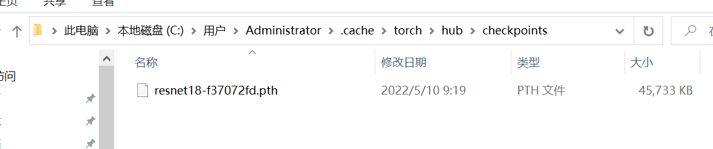
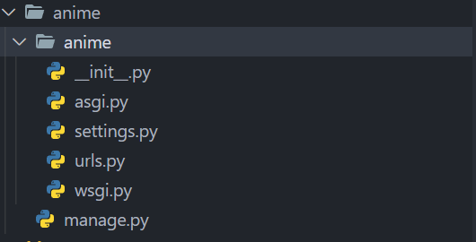
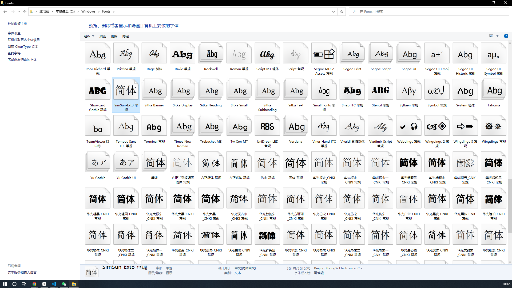
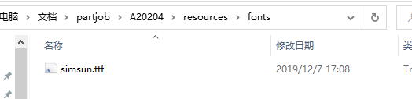
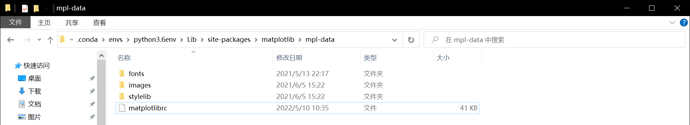
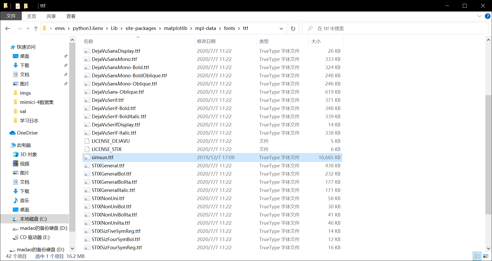
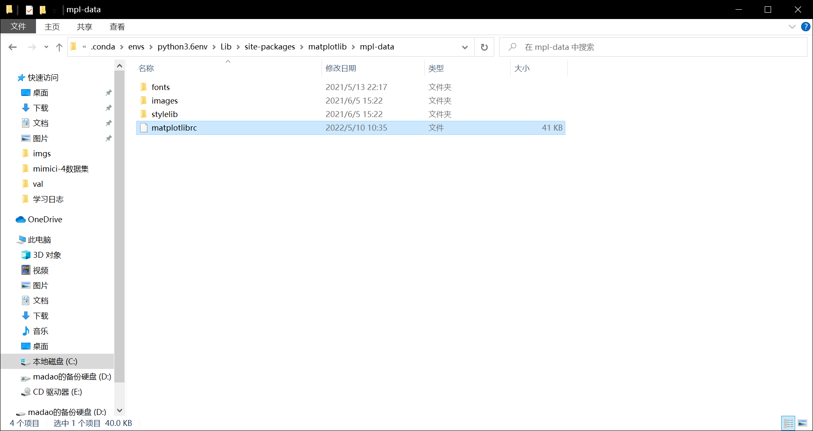
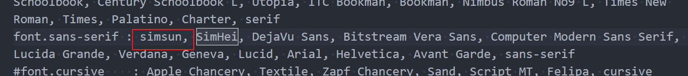
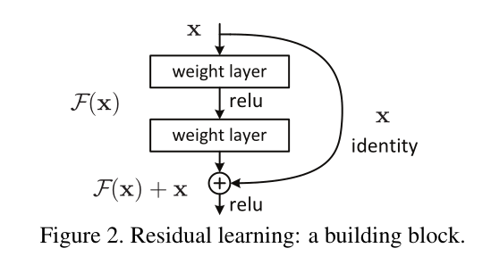
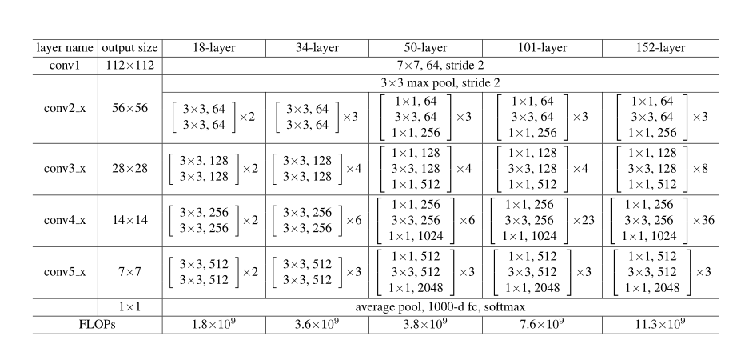

# 动漫人物识别及Django系统搭建

用Django搭建一个web网站可以识别海贼王这部动漫中的大部分人物，人工智能算法要用卷积神经网络


# 人脸识别算法

主要的思路是利用`resnet18`预训练的模型，修改最后一层全连接层的输出层，然后进行迁移学习

### 环境搭建

主要的环境依赖在`requirements.txt`中，建议环境搭建使用`conda`来完成

* 首先利用`conda`创建一个虚拟环境

  ```shell
  conda create -n python3.6env python=3.6
  ```

* 然后切换到创建的虚拟环境中

  ```shell
  conda activate python3.6env
  ```

* 然后根据`requirements.txt`安装依赖

  ```shell
  pip install -r requirements.txt
  ```

导入预训练的模型，如果需要自己重新训练模型，需要将`resources/resnet18-f37072fd.pth`文件拷贝至 `C:\Users\Administrator\.cache\torch\hub\checkpoints`路径下



没有该路径，就自己创建一下，然后打开`codes/resnet-transfer-learning.ipynb`文件，这是个`jupyter-notebook`，可以分段运行

你可以修改`datasets_path`以及`save_path`，分别是数据集的根目录以及模型保存的路径，然后重新运行该`jupyter-notebook`即可

这里我在`resnet18`预训练模型的基础上，修改了全连接层，输出的分类为你给的数据集的人物数量`13`，得到的模型保存在`models/resnet18.pth`，django系统中也是使用的该迁移学习模型进行分类

### 模型架构-resnet18迁移学习

修改后的`resnet18`结构如下

```python
ResNet(
  (conv1): Conv2d(3, 64, kernel_size=(7, 7), stride=(2, 2), padding=(3, 3), bias=False)
  (bn1): BatchNorm2d(64, eps=1e-05, momentum=0.1, affine=True, track_running_stats=True)
  (relu): ReLU(inplace=True)
  (maxpool): MaxPool2d(kernel_size=3, stride=2, padding=1, dilation=1, ceil_mode=False)
  (layer1): Sequential(
    (0): BasicBlock(
      (conv1): Conv2d(64, 64, kernel_size=(3, 3), stride=(1, 1), padding=(1, 1), bias=False)
      (bn1): BatchNorm2d(64, eps=1e-05, momentum=0.1, affine=True, track_running_stats=True)
      (relu): ReLU(inplace=True)
      (conv2): Conv2d(64, 64, kernel_size=(3, 3), stride=(1, 1), padding=(1, 1), bias=False)
      (bn2): BatchNorm2d(64, eps=1e-05, momentum=0.1, affine=True, track_running_stats=True)
    )
    (1): BasicBlock(
      (conv1): Conv2d(64, 64, kernel_size=(3, 3), stride=(1, 1), padding=(1, 1), bias=False)
      (bn1): BatchNorm2d(64, eps=1e-05, momentum=0.1, affine=True, track_running_stats=True)
      (relu): ReLU(inplace=True)
      (conv2): Conv2d(64, 64, kernel_size=(3, 3), stride=(1, 1), padding=(1, 1), bias=False)
      (bn2): BatchNorm2d(64, eps=1e-05, momentum=0.1, affine=True, track_running_stats=True)
    )
  )
  (layer2): Sequential(
    (0): BasicBlock(
      (conv1): Conv2d(64, 128, kernel_size=(3, 3), stride=(2, 2), padding=(1, 1), bias=False)
      (bn1): BatchNorm2d(128, eps=1e-05, momentum=0.1, affine=True, track_running_stats=True)
      (relu): ReLU(inplace=True)
      (conv2): Conv2d(128, 128, kernel_size=(3, 3), stride=(1, 1), padding=(1, 1), bias=False)
      (bn2): BatchNorm2d(128, eps=1e-05, momentum=0.1, affine=True, track_running_stats=True)
      (downsample): Sequential(
        (0): Conv2d(64, 128, kernel_size=(1, 1), stride=(2, 2), bias=False)
        (1): BatchNorm2d(128, eps=1e-05, momentum=0.1, affine=True, track_running_stats=True)
      )
    )
    (1): BasicBlock(
      (conv1): Conv2d(128, 128, kernel_size=(3, 3), stride=(1, 1), padding=(1, 1), bias=False)
      (bn1): BatchNorm2d(128, eps=1e-05, momentum=0.1, affine=True, track_running_stats=True)
      (relu): ReLU(inplace=True)
      (conv2): Conv2d(128, 128, kernel_size=(3, 3), stride=(1, 1), padding=(1, 1), bias=False)
      (bn2): BatchNorm2d(128, eps=1e-05, momentum=0.1, affine=True, track_running_stats=True)
    )
  )
  (layer3): Sequential(
    (0): BasicBlock(
      (conv1): Conv2d(128, 256, kernel_size=(3, 3), stride=(2, 2), padding=(1, 1), bias=False)
      (bn1): BatchNorm2d(256, eps=1e-05, momentum=0.1, affine=True, track_running_stats=True)
      (relu): ReLU(inplace=True)
      (conv2): Conv2d(256, 256, kernel_size=(3, 3), stride=(1, 1), padding=(1, 1), bias=False)
      (bn2): BatchNorm2d(256, eps=1e-05, momentum=0.1, affine=True, track_running_stats=True)
      (downsample): Sequential(
        (0): Conv2d(128, 256, kernel_size=(1, 1), stride=(2, 2), bias=False)
        (1): BatchNorm2d(256, eps=1e-05, momentum=0.1, affine=True, track_running_stats=True)
      )
    )
    (1): BasicBlock(
      (conv1): Conv2d(256, 256, kernel_size=(3, 3), stride=(1, 1), padding=(1, 1), bias=False)
      (bn1): BatchNorm2d(256, eps=1e-05, momentum=0.1, affine=True, track_running_stats=True)
      (relu): ReLU(inplace=True)
      (conv2): Conv2d(256, 256, kernel_size=(3, 3), stride=(1, 1), padding=(1, 1), bias=False)
      (bn2): BatchNorm2d(256, eps=1e-05, momentum=0.1, affine=True, track_running_stats=True)
    )
  )
  (layer4): Sequential(
    (0): BasicBlock(
      (conv1): Conv2d(256, 512, kernel_size=(3, 3), stride=(2, 2), padding=(1, 1), bias=False)
      (bn1): BatchNorm2d(512, eps=1e-05, momentum=0.1, affine=True, track_running_stats=True)
      (relu): ReLU(inplace=True)
      (conv2): Conv2d(512, 512, kernel_size=(3, 3), stride=(1, 1), padding=(1, 1), bias=False)
      (bn2): BatchNorm2d(512, eps=1e-05, momentum=0.1, affine=True, track_running_stats=True)
      (downsample): Sequential(
        (0): Conv2d(256, 512, kernel_size=(1, 1), stride=(2, 2), bias=False)
        (1): BatchNorm2d(512, eps=1e-05, momentum=0.1, affine=True, track_running_stats=True)
      )
    )
    (1): BasicBlock(
      (conv1): Conv2d(512, 512, kernel_size=(3, 3), stride=(1, 1), padding=(1, 1), bias=False)
      (bn1): BatchNorm2d(512, eps=1e-05, momentum=0.1, affine=True, track_running_stats=True)
      (relu): ReLU(inplace=True)
      (conv2): Conv2d(512, 512, kernel_size=(3, 3), stride=(1, 1), padding=(1, 1), bias=False)
      (bn2): BatchNorm2d(512, eps=1e-05, momentum=0.1, affine=True, track_running_stats=True)
    )
  )
  (avgpool): AdaptiveAvgPool2d(output_size=(1, 1))
  (fc): Linear(in_features=512, out_features=13, bias=True)
)
```

然后将你给的数据集分为训练集`train`和测试集`val`，当然这里直接手动分的，-.-

### 模型训练

训练过程的参数为：

* batch_size 16
* learning_rate 0.0001
* 优化方法 adam
* 损失函数 cross entropy(交叉熵损失)

训练的过程中，记录最好的测试准确率的模型，保存准确率最高的模型

### 测试结果

经过20次的迭代训练，模型的训练损失在0.161，测试集的最好准确率在97.2%，绘图展示一下效果如下，标题左为预测结果分类，右为真实分类


# Django系统搭建

这里安装的是`Django 3.2.3`，为了避免版本冲突引起问题，建议安装这个版本，当然主要的依赖在`requirements.txt`中列出，以下的一些步骤是我搭建的一些记录，项目代码已经完成，你可以选择阅读

`Django`系统的所有代码在`codes/anime`文件夹下，运行的方式是在命令行下切换至该路径下，然后运行`manage.py`，并添加参数`runserver`

```shell
cd path/to/anime
python manage.py runserver
```

运行无误的情况下，打开网页，输入[http://127.0.0.1:8000](http://127.0.0.1:8000/)，即可访问该系统

### 创建Django项目

切换到对应文件路径，输入以下命令行

```shell
django-admin startproject anime
```

运行该命令之后，得到以下文件·



### 迁移数据

在创建`Django`项目之后，有一些默认的数据库需要创建，运行一下命令

```shell
python manage.py makemigrations
python manage.py migrate
```

完成数据库创建，当然这一步已经完成，并不需要你的操作

### 创建Django应用

使用命令

```shell
python manage.py createapp appname
```

创建一个`Django`应用，然后在其中添加自己的代码

### 功能实现

这里主要的有一个界面`index.html`，界面效果如下


中间显示上传的图片，图片下方显示识别的结果

下一行分别是选择上传的图片，以及点击上传

使用的方法是：

* 首先点击选择文件，会自动打开文件浏览器，然后在文件浏览器中选择要识别的图片
* 然后点击上传，等待一小会就可以出现结果了

# bug fix

### 绘图中文显示问题

`matplotlib`默认没有中文，需要自己修改字体设置，以下简要说明一下`windows 10`系统下如何修改字体

首先找到自己电脑中字体文件的文件夹，一般情况下是在`C:\Windows\Fonts`路径



这里选择一个字体文件`simsun.ttf`，**为了方便你操作，已经将该字体文件拷贝至本项目的resource文件夹中**



然后通过`python`代码查找当前`python`虚拟环境对应的`matplot`文件库以及配置路径

```python
import matplotlib
print(matplotlib.matplotlib_fname())
print(matplotlib.get_cachedir())
```

运行上述代码得到两个路径

```shell
C:\Users\Administrator\.conda\envs\python3.6env\lib\site-packages\matplotlib\mpl-data\matplotlibrc
C:\Users\Administrator\.matplotlib
```

因为我使用的是虚拟环境，所以可以肯定该路径为`C:\Users\Administrator\.conda\envs\python3.6env\lib\site-packages\matplotlib\mpl-data\matplotlibrc`

**不同的电脑安装的虚拟环境不同，路径也不相同，这一步需要自己运行上述代码来查找路径**

之后打开该文件路径



将刚刚说道的字体文件`simsun.ttf`复制到`fonts/ttf`文件夹下



然后打开`matplotlibrc`文件，可以使用记事本打开



找到其中第一个`font.family`，将其中的`#`去掉



然后再找到`font.sans-serif`，在`:`后添加`simsun`

之后通过`python`运行

```python
from matplotlib.font_manager import _rebuild
_rebuild()
```

重新构建字体，之后就可以修改对应的字体

# 效果展示

演示效果查看视频[django-system](resources/django-system.mp4)

# 所用的技术-ResNet说明 ==补充内容==

随着神经网络的加深，网络出现退化的现象，这表明并非所有系统都同样容易优化。网络退化出现的原因是现有的网络无法实现恒等映射。将想要的恒等映射函数表示为$H(x)=x$，残差网络设计 $H(x)=F(x) + x$，即直接将恒等映射作为网络的一部分，将问题转化成学习一个残差函数 $F(x) = H(x) - x$，只要 $F(x)=0$，就可以构成一个恒等映射 $H(X)=x$，拟合残差比拟合恒等映射容易的多。



该程序中的人脸识别使用的是resnet18结构



## 迁移学习

对比原生resnet18分类的是将数据集分为1000类，所以最后全连接层输出层大小为1000，这里首先初始化一个resnet18模型，并导入resnet18训练好的参数，将最后一层输出层改为自己数据集分类的数量，例如分为10类，就将输出层改为10，然后再用自己的数据集进行训练，最后保存模型

# 系统设计部分 ==补充内容==

关于系统设计部分，主要使用的是`django`系统，便于构建网站系统，主要实现的有以下功能：

* 文件上传

  设置表单`Form`实现上传，上传的文件在`request.FILES`字典以`img`为键的值中，获取到图片文件之后，将图片文件保存在`static/upload`文件夹中

* 人物识别

  在文件上传之后，对文件进行识别，首先读取文件，然后进行一系列的预处理，包括标准化以及维度变换等，然后通过保存的神经网络模型进行识别

* 结果展示

  将神经网络预测的值通过字典映射为对应人物的名称，显示预测结果以及上传的图片

# 参考文献

<div id="ref-1"></div>

[1] [知乎文章：你必须要知道CNN模型：ResNet](https://zhuanlan.zhihu.com/p/31852747/)


